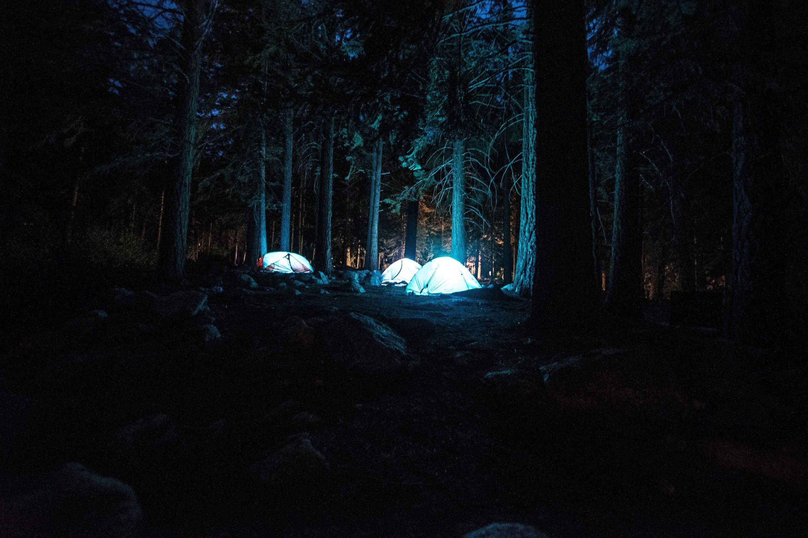

<h1 align="center"><a href='https://shadyyelpcamp.herokuapp.com/'>Shady Yelp Camp</a></h1>

## Table of Contents

- [Overview](#overview)
  - [Built With](#built-with)
- [Features](#features)
- [Contact](#contact)

<!-- OVERVIEW -->

## Overview

Code repository for a full stack web application of a camping website. This project implements CRUD functionality on a RESTApi. Built with nodejs &amp; expressjs on the serverside, Ejs for templating, bootstrap5 for styling and mongoDB as the dabase. Undergoing further improvement

### Built With

<!-- This section should list any major frameworks that you built your project using. Here are a few examples.-->

  
  
  
  
  

## Features

<!-- List the features of your application or follow the template. Don't share the figma file here :) -->
 - Create, read, edit and delete a camp ground 
 - Create, edit and delete a user profile 
 - Add comments to a particular campground
 - Seperation of concerns 
 - Admin privileges for owners of specific campgrounds
 

### Contact🌍
[][twitter]
[][linkedin]
[][website]

 

[website]: https://iyanushowportfolio.netlify.app/
[twitter]: https://twitter.com/the_iyanu
[linkedin]: https://www.linkedin.com/in/iyanuoluwa-sowande-0522/
